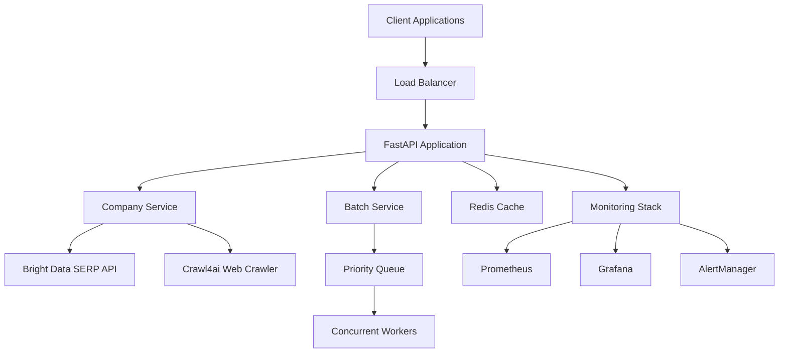

# Company Information Extraction API

**Production Ready** 🚀 - Comprehensive company intelligence platform combining Google SERP search with advanced web crawling for automated business data extraction.

**Complete Solution**: Enterprise-grade FastAPI application with intelligent company data extraction, batch processing, performance optimization, security hardening, and comprehensive monitoring.

## Key Features

### 🔍 **Intelligent Company Extraction**
- **Comprehensive Data**: Company overview, financial data, contact information, key personnel
- **Multiple Modes**: Basic (15-30s), Standard (30-60s), Comprehensive (45-90s), Specialized modes
- **High Accuracy**: AI-powered extraction with confidence scoring and validation
- **Global Coverage**: Multi-language support with country-specific search localization

### ⚡ **Enterprise Performance**
- **Batch Processing**: Handle 1-100+ companies simultaneously with priority queuing
- **Advanced Caching**: Redis-based caching with 60-80% cache hit rates
- **Concurrent Processing**: Intelligent resource management and rate limiting
- **Performance Monitoring**: Real-time metrics and automated optimization

### 🛡️ **Production Ready**
- **Security Hardening**: API authentication, rate limiting, input validation
- **Comprehensive Monitoring**: Prometheus metrics, Grafana dashboards, alerting
- **High Availability**: Docker deployment, load balancing, health checks
- **Complete Documentation**: API docs, deployment guides, operational runbooks

## Quick Start

### Method 1: Using UV (Recommended)
```bash
# Clone repository
git clone <repository-url>
cd crawl4ai_GoogleSERP

# Create environment and install dependencies
uv venv
source .venv/bin/activate  # Windows: .venv\Scripts\activate
uv pip install -r requirements.txt

# Configure environment
cp .env.example .env
# Edit .env with your API tokens

# Start application
uv run python main.py
```

### Method 2: Traditional Python Setup
```bash
# Create virtual environment
python3 -m venv venv
source venv/bin/activate  # Windows: venv\Scripts\activate
pip install -r requirements.txt

# Configure environment
cp .env.example .env
# Edit .env with your Bright Data credentials

# Start application
python main.py
```

### Method 3: Docker Deployment
```bash
# Quick Docker start
docker-compose up --build

# Or production deployment
docker-compose -f deployment/docker-compose.prod.yml up -d
```

### Method 4: One-Click Launch
```bash
# Unix/Linux/macOS
./run.sh

# Windows
run.bat
```

## API Examples

### Extract Single Company
```bash
curl -X POST "http://localhost:8000/api/v1/company/extract" \
  -H "Content-Type: application/json" \
  -d '{
    "company_name": "OpenAI",
    "extraction_mode": "comprehensive"
  }'
```

### Batch Processing
```bash
curl -X POST "http://localhost:8000/api/v1/company/batch/submit" \
  -H "Content-Type: application/json" \
  -d '{
    "company_names": ["OpenAI", "Microsoft", "Google"],
    "extraction_mode": "standard",
    "priority": "high"
  }'
```

### Python SDK Example
```python
import httpx
import asyncio

async def extract_company():
    async with httpx.AsyncClient() as client:
        response = await client.post(
            "http://localhost:8000/api/v1/company/extract",
            json={
                "company_name": "Tesla",
                "extraction_mode": "comprehensive",
                "include_financial_data": True
            }
        )
        
        data = response.json()["data"]
        print(f"Company: {data['company_name']}")
        print(f"Industry: {data['industry']}")
        print(f"Valuation: {data['financial_data']['valuation']}")

asyncio.run(extract_company())
```

## Core API Endpoints

| Endpoint | Method | Description |
|----------|--------|-------------|
| `/api/v1/company/extract` | POST | Extract single company information |
| `/api/v1/company/batch/submit` | POST | Submit batch extraction request |
| `/api/v1/company/batch/{id}/status` | GET | Get batch processing status |
| `/api/v1/company/batch/{id}/results` | GET | Get batch results |
| `/api/v1/company/health` | GET | Company service health check |
| `/api/v1/health` | GET | System health check |
| `/api/v1/search` | POST | Google SERP search |
| `/api/v1/crawl` | POST | Web page crawling |

## Extraction Modes

| Mode | Duration | Use Case | Data Points |
|------|----------|----------|-------------|
| **Basic** | 15-30s | Quick validation | ~15-20 fields |
| **Standard** | 30-60s | General research | ~30-40 fields |
| **Comprehensive** | 45-90s | Due diligence | ~50+ fields |
| **Contact Focused** | 20-40s | Sales prospecting | Contact-heavy |
| **Financial Focused** | 30-60s | Investment research | Financial-heavy |

## Web Interfaces

### Streamlit Frontends
```bash
# Native multi-page app (recommended)
streamlit run frontend/🏠_Home.py

# Single-page app
streamlit run frontend/streamlit_app.py

# Multi-page with radio buttons
streamlit run frontend/streamlit_multipage_app.py
```

### API Documentation
```bash
# Interactive Swagger UI
http://localhost:8000/docs

# Alternative ReDoc
http://localhost:8000/redoc
```

## Configuration

### Environment Variables

```bash
# External APIs
BRIGHT_DATA_TOKEN=your_bright_data_token
BRIGHT_DATA_ZONE=serp_api1

# Redis Configuration
REDIS_URL=redis://localhost:6379/0
CACHE_ENABLED=true

# Performance Tuning
MAX_CONCURRENT_EXTRACTIONS=10
MAX_CONCURRENT_SEARCHES=15
BATCH_PROCESSING_ENABLED=true

# Security
API_KEY_REQUIRED=false  # Enable for production
RATE_LIMITING_ENABLED=true

# Monitoring
PERFORMANCE_MONITORING_ENABLED=true
LOG_LEVEL=INFO
```

### Production Configuration
```bash
# Application
ENVIRONMENT=production
DEBUG=false
HOST=0.0.0.0
PORT=8000

# Security
API_KEY_REQUIRED=true
RATE_LIMITING_ENABLED=true
CORS_ORIGINS=https://yourdomain.com

# Performance
MAX_MEMORY_MB=2048
CONNECTION_POOL_SIZE=50
CACHE_TTL=86400

# Monitoring
METRICS_RETENTION_HOURS=168
SLACK_WEBHOOK_URL=https://hooks.slack.com/...
```

## Architecture Overview

### Core Components



### Data Flow

1. **Request Processing**: Client submits company extraction request
2. **Cache Check**: System checks Redis cache for existing data
3. **Search Phase**: Google SERP API searches for company information
4. **Crawling Phase**: Crawl4ai extracts detailed data from company websites
5. **Data Processing**: AI-powered parsing and validation of extracted content
6. **Response Delivery**: Structured company data returned with confidence scores

## Testing

### Run Test Suite
```bash
# Full test suite
pytest

# With coverage report
pytest --cov=app --cov-report=html

# Specific test categories
pytest tests/test_company_integration.py -v
pytest tests/test_batch_processing.py -v
pytest tests/test_security_integration.py -v
```

### Integration Testing
```bash
# Test company extraction
python examples/example_company_extraction.py

# Test batch processing
python scripts/test_batch_linkedin.py

# Performance testing
python scripts/test_performance_optimizations.py
```

## Deployment

### Docker Deployment
```bash
# Development
docker-compose up --build

# Production
docker-compose -f deployment/docker-compose.prod.yml up -d

# With monitoring stack
docker-compose -f deployment/docker-compose.prod.yml --profile monitoring up -d
```

### Kubernetes Deployment
```bash
# Apply Kubernetes manifests
kubectl apply -f deployment/kubernetes/

# Monitor deployment
kubectl rollout status deployment/company-extraction-api
```

### Cloud Deployment
- **AWS**: ECS/Fargate deployment guide
- **Google Cloud**: Cloud Run deployment guide  
- **Azure**: Container Instances deployment guide

See [Deployment Documentation](docs/deployment/) for detailed guides.

## Monitoring and Operations

### Health Monitoring
```bash
# System health
curl http://localhost:8000/api/v1/health

# Detailed health with dependencies
curl http://localhost:8000/api/v1/health/detailed

# Company service health
curl http://localhost:8000/api/v1/company/health

# Batch processing statistics
curl http://localhost:8000/api/v1/company/batch/stats
```

### Performance Metrics
- **Response Times**: 95th percentile tracking
- **Cache Performance**: Hit/miss ratios and efficiency
- **Resource Utilization**: CPU, memory, and connection monitoring
- **Business Metrics**: Extraction success rates and confidence scores

### Operational Dashboards
- **Grafana**: System and business metrics visualization
- **Kibana**: Log analysis and troubleshooting
- **Prometheus**: Metrics collection and alerting

## Use Cases

### Sales Intelligence
```python
# Extract prospects for sales team
companies = ["Salesforce", "HubSpot", "Pipedrive"]
result = await batch_extract(companies, mode="contact_focused")
```

### Investment Research  
```python
# Analyze potential investments
companies = ["Stripe", "SpaceX", "Databricks"]
result = await batch_extract(companies, mode="financial_focused")
```

### Competitive Analysis
```python
# Research competitors
competitors = ["Microsoft", "Google", "Amazon"]
result = await batch_extract(competitors, mode="comprehensive")
```

### Market Research
```python
# Industry analysis
fintech_companies = ["PayPal", "Square", "Klarna", "Affirm"]
result = await batch_extract(fintech_companies, mode="standard")
```

## Performance Benchmarks

### Response Times
- **Basic Mode**: 15-30 seconds average
- **Standard Mode**: 30-60 seconds average
- **Comprehensive Mode**: 45-90 seconds average
- **Cache Hit**: < 1 second response time

### Throughput
- **Single Extraction**: 100-200 companies/hour
- **Batch Processing**: 500-1000 companies/hour
- **Concurrent Processing**: Up to 20 simultaneous extractions

### Resource Usage
- **Memory**: 2-4GB recommended for production
- **CPU**: 4+ cores recommended for high throughput
- **Storage**: 100GB+ for logs and cache data
- **Network**: 100+ Mbps for optimal performance

## Integrations

### CRM Systems
- **Salesforce**: Direct CRM integration examples
- **HubSpot**: Contact and company synchronization
- **Pipedrive**: Lead enrichment workflows

### Business Intelligence
- **Power BI**: Data connector and visualization
- **Tableau**: Web data connector
- **Excel**: Direct data export capabilities

### Development Tools  
- **Python SDK**: Native Python integration
- **REST API**: Standard HTTP API for all languages
- **Webhooks**: Event-driven integrations
- **Batch APIs**: Efficient bulk processing

## Security

### Authentication
- **API Keys**: Token-based authentication
- **Rate Limiting**: IP-based request throttling
- **Input Validation**: Comprehensive request validation

### Data Protection
- **Encryption**: TLS/SSL for all communications
- **Data Privacy**: No sensitive data logging
- **Compliance**: GDPR and privacy regulation compliance

### Security Monitoring
- **Intrusion Detection**: Automated threat detection
- **Audit Logging**: Comprehensive security event logging
- **Access Control**: Role-based access management

## Support and Documentation

### Documentation
- **[API Documentation](docs/api/)**: Complete API reference with examples
- **[User Guide](docs/user/)**: Getting started and integration guides
- **[Deployment Guide](docs/deployment/)**: Production deployment instructions
- **[Operations Guide](docs/operations/)**: Monitoring and maintenance procedures

### Example Code
- **[Python Examples](examples/)**: Complete usage examples
- **[Integration Examples](docs/user/integration-examples.md)**: CRM and BI integrations
- **[Performance Examples](scripts/)**: Optimization and testing scripts

### Community
- **Issues**: GitHub repository for bug reports and feature requests
- **Discussions**: Community forum for questions and best practices
- **Contributions**: Pull requests welcome following contribution guidelines

## Technology Stack

### Core Technologies
- **Framework**: FastAPI with async/await
- **Language**: Python 3.11+
- **Database**: Redis for caching and session management
- **Search**: Bright Data Google SERP API
- **Crawling**: Crawl4ai AsyncWebCrawler
- **Monitoring**: Prometheus, Grafana, ELK Stack

### External APIs
- **Bright Data**: Google SERP search results
- **Crawl4ai**: Advanced web crawling and content extraction
- **Redis**: High-performance caching and data storage

### Infrastructure
- **Containerization**: Docker with multi-stage builds
- **Orchestration**: Docker Compose, Kubernetes support
- **Load Balancing**: Nginx with health checks
- **Monitoring**: Comprehensive observability stack

### Development
- **Testing**: pytest with comprehensive coverage
- **Code Quality**: Black, flake8, mypy type checking
- **CI/CD**: GitHub Actions with automated testing and deployment
- **Documentation**: Comprehensive docs with examples and guides

## License

[Specify your license here]

## Contributing

We welcome contributions! Please see [CONTRIBUTING.md](CONTRIBUTING.md) for guidelines on:
- Code standards and formatting
- Testing requirements
- Pull request process
- Issue reporting

## Changelog

See [CHANGELOG.md](CHANGELOG.md) for version history and release notes.

---

**Ready to extract company intelligence at scale?** Start with our [Quick Start Guide](docs/user/README.md) or try the [live examples](examples/) to see the power of automated company data extraction.